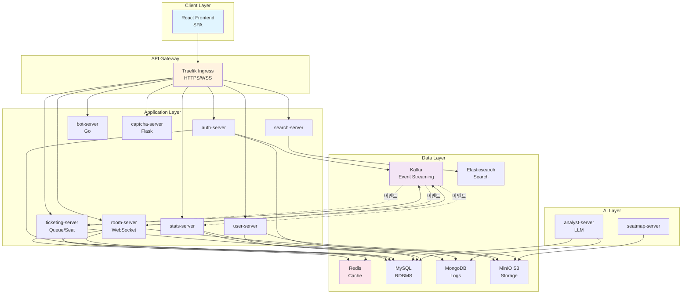
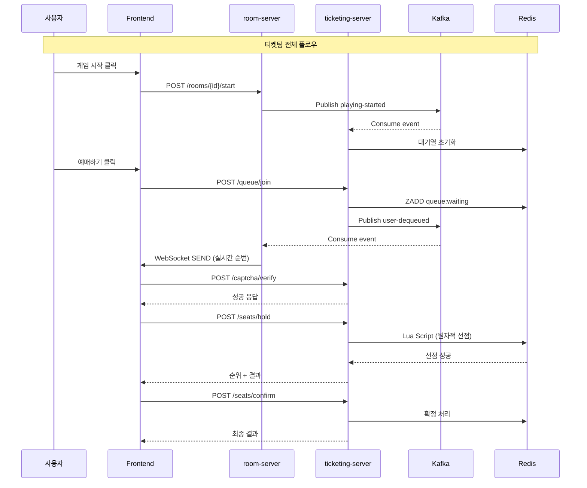
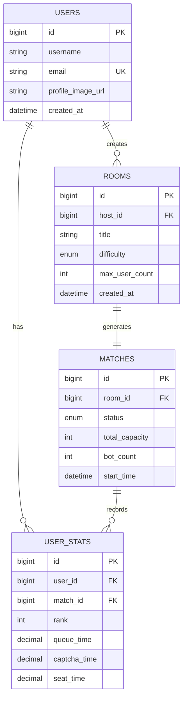

# 🎫 TickGet - 실시간 티켓팅 연습 플랫폼

<div align="center">


**실전처럼 연습하고, 경쟁하며 성장하는 티켓팅 시뮬레이터**

[](https://opensource.org/licenses/MIT)
[](https://k3s.io/)
[](https://react.dev/)
[](https://spring.io/projects/spring-boot)
[](https://golang.org/)

[🌐 데모 사이트](https://tickget.kr) | [📖 기술 문서](./docs) | [🎥 시연 영상](https://youtube.com)

</div>

---

## 📋 목차

- [프로젝트 소개](#-프로젝트-소개)
- [주요 기능](#-주요-기능)
- [기술 스택](#-기술-스택)
- [시스템 아키텍처](#-시스템-아키텍처)
- [핵심 기술 구현](#-핵심-기술-구현)
- [시작하기](#-시작하기)
- [프로젝트 구조](#-프로젝트-구조)
- [팀 소개](#-팀-소개)

---

## 🎯 프로젝트 소개

### 개요

**TickGet**은 실제 티켓팅 환경을 시뮬레이션하여 사용자가 안전하게 연습하고 실력을 향상시킬 수 있는 **클라우드 네이티브 마이크로서비스 플랫폼**입니다.

### 배경 및 목적

매번 티켓팅에 실패하시나요? 😢

- **문제점**: 실전 티켓팅은 단 한 번의 기회, 연습할 방법이 없음
- **해결책**: 실제와 동일한 환경에서 무제한 연습 가능
- **차별점**:
  - 🤖 **AI 봇 10,000명**과 경쟁하는 실전 시뮬레이션
  - 👥 **친구와 함께** 멀티플레이 대기실에서 연습
  - 📊 **AI 분석 리포트**로 개인 맞춤형 피드백 제공
  - 🏟️ **실제 공연장 배치도** 또는 AI 생성 좌석 배치

### 핵심 가치

```
실전처럼 연습하라 → 경쟁하며 성장하라 → 데이터로 분석하라
```

---

## ✨ 주요 기능

### 1. 🎮 실시간 멀티플레이 대기실

- **방 생성 및 관리**: 친구들과 함께 티켓팅 연습 방 생성
- **WebSocket 실시간 동기화**: 입장/퇴장, 설정 변경 즉시 반영
- **난이도 선택**: EASY / MEDIUM / HARD (봇 행동 패턴 차이)
- **공연장 선택**: 프리셋 (소형/중형/대형) 또는 AI 생성

### 2. ⏱️ 4단계 티켓팅 시뮬레이션

#### Stage 1: 예매 버튼 클릭
- 게임 시작과 동시에 "예매하기" 버튼 클릭 경쟁
- 반응 속도 측정 (밀리초 단위)

#### Stage 2: 대기열
- **공정한 선착순 보장** (Redis Sorted Set)
- 실시간 대기 순번 확인 (앞/뒤/전체)
- 봇과 함께 대기 (0~10,000명)

#### Stage 3: CAPTCHA 검증
- 보안 문자 입력 (오답 횟수 추적)
- 음성 CAPTCHA 지원 (접근성)
- 시간 제한 압박 체험

#### Stage 4: 좌석 선택 및 결제
- **동시성 제어**: Redis Lua 스크립트로 "이선좌" 방지
- 실제 공연장 배치도 기반 좌석 선택
- TTL 10분 자동 해제 (시간 압박)

### 3. 📊 개인 성적 분석

- **단계별 소요 시간**: 대기열 → CAPTCHA → 좌석 선택
- **실시간 순위**: 실제 사용자 중 순위 (봇 제외)
- **실수 추적**: CAPTCHA 오답, 좌석 클릭 미스, 이선좌 횟수
- **AI 분석 리포트**: 10회 이상 플레이 시 LLM 기반 맞춤형 피드백

### 4. 🤖 AI 봇 시뮬레이션

- **난이도별 행동 패턴**:
  - EASY: 느린 응답, 낮은 등급 선호, 실수율 30%
  - MEDIUM: 보통 속도, 중간 등급, 실수율 15%
  - HARD: 빠른 응답, 프리미엄 좌석 선호, 실수율 5%
- **Go 언어 기반**: 10,000개 동시 봇 실행 (고루틴)
- **실시간 트래픽 생성**: 실제 경쟁 환경 재현

### 5. 🔍 공연장 검색 (Elasticsearch)

- **자동완성 검색**: N-gram 기반 부분 일치
- **한글 형태소 분석**: Nori Analyzer (조사 제거)
- **3,230개 공연장**: 전국 공연 시설 데이터

---

## 🛠️ 기술 스택

### Frontend

| 카테고리 | 기술 | 버전 | 선택 이유 |
|---------|------|------|-----------|
| **Core** | React | 19.2 | 최신 동시성 렌더링, 자동 배치 업데이트 |
| **언어** | TypeScript | 5.9 | 타입 안정성, 런타임 에러 감소 |
| **빌드** | Vite | 7.1 | ESBuild 기반 초고속 빌드 (HMR < 50ms) |
| **상태관리** | Zustand | 5.0 | 보일러플레이트 최소화 (Redux 대비 1/3 코드) |
| **스타일링** | Tailwind CSS + MUI | 4.1 + 7.3 | 유틸리티 우선 + 완성도 높은 컴포넌트 |
| **실시간 통신** | STOMP over SockJS | 7.2 | WebSocket 구독/발행 패턴 |
| **라우팅** | React Router | 7.9 | SPA 네비게이션 최적화 |

### Backend - Microservices

| 서비스 | 언어/프레임워크 | 주요 역할 |
|--------|----------------|----------|
| **auth-server** | Spring Boot 3.5 (Java 21) | OAuth2 소셜 로그인, JWT 발급 |
| **room-server** | Spring Boot 3.5 (Java 21) | WebSocket 대기실, Kafka 이벤트 발행 |
| **ticketing-server** | Spring Boot 3.5 (Java 21) | 대기열, 좌석 선점, CAPTCHA 검증 |
| **user-server** | Spring Boot 3.5 (Java 21) | 사용자 정보, 프로필 관리 |
| **search-server** | Spring Boot 3.5 (Java 21) | Elasticsearch 공연장 검색 |
| **stats-server** | Spring Boot 3.5 (Java 21) | 통계 집계, 순위 계산 |
| **bot-server** | Go 1.25 | 봇 시뮬레이션 (고성능 동시성) |
| **captcha-server** | Python Flask | CAPTCHA 생성/검증 |

### AI Services

| 서비스 | 프레임워크 | 주요 역할 |
|--------|-----------|----------|
| **seatmap-server** | Python Flask + OpenCV | 이미지 기반 좌석 배치 AI 생성 |
| **analyst-server** | Python FastAPI + LLM | 사용자 성적 AI 분석 리포트 |

### Infrastructure

| 서비스 | 기술 | 용도 |
|--------|------|------|
| **Message Queue** | Apache Kafka 3.8 | 이벤트 스트리밍 (12개 토픽) |
| **Cache** | Redis 7.2 | 대기열(Sorted Set), 좌석 선점(Lua), 세션 |
| **Database** | MySQL 8.0 | 사용자, 방, 매치, 통계 (ACID) |
| **NoSQL** | MongoDB 7.0 | 행동 로그 (대용량 쓰기) |
| **Search Engine** | Elasticsearch 8.11 | 공연장 전문 검색 |
| **Object Storage** | MinIO S3 | 프로필 이미지, 공연장 HTML/JSON |
| **Logging** | Loki + Promtail | 중앙 집중식 로그 수집 |
| **Monitoring** | Prometheus + Grafana | 메트릭 및 대시보드 |

### DevOps & Infrastructure

| 카테고리 | 기술 | 설명 |
|---------|------|------|
| **Container** | Docker + Docker Buildx | ARM64 멀티 아키텍처 빌드 |
| **Orchestration** | Kubernetes (K3s) | 경량 K8s, AWS EC2 ARM64 (Graviton) |
| **IaC** | Kustomize | Base + Overlays 환경 분리 |
| **Ingress** | Traefik 2.x | HTTPS/WSS 통합 라우팅 |
| **CI/CD** | GitLab CI + ArgoCD | GitOps 자동 배포 |
| **TLS** | Cert-Manager + Let's Encrypt | 자동 인증서 갱신 |

---

## 🏗️ 시스템 아키텍처

### 전체 아키텍처



### 마이크로서비스 통신 패턴



### 데이터베이스 아키텍처



---

## 🔥 핵심 기술 구현

### 1. 실시간 대기열 시스템 (Redis Sorted Set)

**문제**: 10,000명 동시 접속 시 공정한 선착순 보장

**해결책**: Redis Sorted Set + Timestamp Score

```java
// 대기열 진입 (O(log N) 시간복잡도)
redisTemplate.opsForZSet()
    .add("queue:" + matchId + ":waiting", userId, System.currentTimeMillis());

// 실시간 순번 조회
Long rank = redisTemplate.opsForZSet().rank("queue:" + matchId + ":waiting", userId);
Long total = redisTemplate.opsForZSet().size("queue:" + matchId + ":waiting");
```

**성능**: 10,000명 대기열에서 < 50ms 응답

---

### 2. 좌석 선점 동시성 제어 (Redis Lua Script)

**문제**: 1,000명이 동시에 같은 좌석 클릭 시 "이선좌" 방지

**해결책**: Redis Lua 스크립트로 원자적 실행

```lua
-- Redis Lua Script (원자적 실행 보장)
local key = "seat:" .. matchId .. ":" .. seatId
if redis.call("EXISTS", key) == 0 then
    redis.call("SETEX", key, 600, userId .. ":" .. grade)  -- TTL 10분
    redis.call("INCR", "match:" .. matchId .. ":reserved_count")
    return 1  -- 선점 성공
else
    return 0  -- 이선좌 (Already Taken)
end
```

**효과**: 동시성 100% 보장, 네트워크 왕복 1회로 감소 (성능 2배)

---

### 3. WebSocket 분산 서버 메시지 동기화 (Kafka)

**문제**: room-server 3개 인스턴스에 사용자 분산 → 메시지 동기화 필요

**해결책**: Kafka Pub/Sub + Redis 세션 매핑

```java
// 1. 사용자 입장 이벤트 발행
kafkaTemplate.send("room-user-joined-events", RoomEvent.builder()
    .roomId(roomId)
    .userId(userId)
    .build());

// 2. 모든 인스턴스가 이벤트 수신
@KafkaListener(topics = "room-user-joined-events")
public void handleUserJoined(RoomEvent event) {
    // 3. 해당 방에 구독 중인 모든 클라이언트에게 WebSocket 전송
    messagingTemplate.convertAndSend("/topic/rooms/" + event.getRoomId(), event);
}
```

**효과**: 분산 환경에서 실시간 동기화, 서버 확장 용이

---

### 4. HPA 자동 스케일링 (Kubernetes)

**문제**: 로그인 트래픽 급증 시 응답 지연

**해결책**: Horizontal Pod Autoscaler (CPU/Memory 기반)

```yaml
apiVersion: autoscaling/v2
kind: HorizontalPodAutoscaler
metadata:
  name: auth-server-hpa
spec:
  minReplicas: 3
  maxReplicas: 20
  metrics:
  - type: Resource
    resource:
      name: cpu
      target:
        averageUtilization: 70  # CPU 70% 넘으면 스케일 아웃
```

**효과**: CPU 70% 초과 시 자동 증설, 트래픽 감소 시 5분 후 축소

---

### 5. N-gram 자동완성 검색 (Elasticsearch)

**문제**: "예술" 입력 시 "예술의전당" 매칭 필요

**해결책**: Edge N-gram Analyzer + Nori 형태소 분석

```json
{
  "settings": {
    "analysis": {
      "analyzer": {
        "ngram_analyzer": {
          "tokenizer": "edge_ngram_tokenizer",
          "filter": ["lowercase"]
        }
      },
      "tokenizer": {
        "edge_ngram_tokenizer": {
          "type": "edge_ngram",
          "min_gram": 1,
          "max_gram": 20
        }
      }
    }
  }
}
```

**성능**: 3,230개 공연장에서 < 10ms 검색

---

### 6. GitOps 자동 배포 (ArgoCD)

**플로우**:
```
Developer Git Push
    ↓
GitLab CI 빌드 (Docker ARM64)
    ↓
Manifest Repo 이미지 태그 업데이트
    ↓
ArgoCD Sync (3분 폴링)
    ↓
Kubernetes Rolling Update
    ↓
무중단 배포 완료 ✅
```

**효과**: Git = Single Source of Truth, 수동 배포 제로화

---

## 🚀 시작하기

### 사전 요구사항

- **로컬 개발**
  - Node.js 20.x
  - Java 21
  - Go 1.25
  - Python 3.11
  - Docker Desktop

- **배포 환경**
  - Kubernetes (K3s) 클러스터
  - kubectl, Kustomize
  - ArgoCD

### 로컬 실행

#### Frontend
```bash
cd Frontend
npm install
npm run dev
# http://localhost:5173
```

#### Backend (예시: auth-server)
```bash
cd Backend/auth-server
./gradlew bootRun
# http://localhost:8080
```

#### bot-server (Go)
```bash
cd Backend/bot-server
cp .env.example .env
go run main.go
```

#### captcha-server (Python)
```bash
cd Backend/catpcha-server
pip install -e '.[dev]'
flask run
```

### Kubernetes 배포

```bash
# 1. Namespace 생성
kubectl apply -f tickget-k8s-manifest/namespaces/

# 2. 인프라 배포
kubectl apply -k tickget-k8s-manifest/infra/kafka/
kubectl apply -k tickget-k8s-manifest/infra/redis/

# 3. 애플리케이션 배포
kubectl apply -k tickget-k8s-manifest/apps/frontend/overlays/dev
kubectl apply -k tickget-k8s-manifest/apps/auth-server/overlays/dev

# 4. ArgoCD 자동 배포 설정
kubectl apply -f tickget-k8s-manifest/argocd-apps/
```

---

## 📁 프로젝트 구조

```
Tickget/
├── Frontend/                    # React 프론트엔드
│   ├── src/
│   │   ├── pages/              # 페이지 컴포넌트
│   │   ├── features/           # 기능별 로직
│   │   ├── shared/             # 공통 모듈
│   │   └── app/                # 라우팅, 레이아웃
│   ├── package.json
│   └── vite.config.ts
│
├── Backend/                     # 백엔드 마이크로서비스
│   ├── auth-server/            # Spring Boot (OAuth2 + JWT)
│   ├── room-server/            # Spring Boot (WebSocket + Kafka)
│   ├── ticketing-server/       # Spring Boot (Queue + Seat)
│   ├── user-server/            # Spring Boot (Profile)
│   ├── search-server/          # Spring Boot (Elasticsearch)
│   ├── stats-server/           # Spring Boot (Analytics)
│   ├── bot-server/             # Go (Bot Simulation)
│   └── catpcha-server/         # Python Flask (CAPTCHA)
│
├── AI/                          # AI 서비스
│   ├── seatmap_to_html/        # Python Flask (OpenCV)
│   └── AI_analyst/             # Python FastAPI (LLM)
│
└── tickget-k8s-manifest/        # Kubernetes 배포 (별도 Repo)
    ├── apps/                    # Application 배포
    ├── infra/                   # Infrastructure 배포
    ├── global-ingress/          # Traefik 라우팅
    └── argocd-apps/             # ArgoCD Application 정의
```

---

## 📊 성능 지표

| 메트릭 | 값 | 설명 |
|--------|-----|------|
| **동시 접속자** | 10,000명 | WebSocket + Kafka 분산 처리 |
| **TPS** | 5,000 | 초당 트랜잭션 처리량 |
| **대기열 응답** | < 50ms | Redis Sorted Set |
| **좌석 선점** | 1,000 TPS | Redis Lua Script |
| **검색 속도** | < 10ms | Elasticsearch N-gram |
| **캐시 조회** | < 1ms | Redis In-Memory |
| **배포 시간** | 3분 | ArgoCD Rolling Update |

---

## 🎥 데모 영상

[](https://youtube.com)

- **실시간 대기실**: 친구와 함께 방 생성 및 입장
- **티켓팅 시뮬레이션**: 대기열 → CAPTCHA → 좌석 선택
- **결과 분석**: 단계별 소요 시간 및 순위 확인

---

## 📚 문서

- [기술 문서](./TICKGET_기술_문서_상세.md) - 각 서버의 기술 스택 및 구현 상세
- [아키텍처 다이어그램](./TICKGET_아키텍처_다이어그램.md) - Mermaid 기반 시각화
- [Kubernetes 배포 가이드](./TICKGET_Kubernetes_배포_가이드.md) - K8s 배포 완벽 가이드
- [API 문서](https://tickget.kr/swagger-ui) - Swagger UI

---

## 🤝 기여하기

프로젝트에 기여하고 싶으신가요?

1. Fork the Project
2. Create your Feature Branch (`git checkout -b feature/AmazingFeature`)
3. Commit your Changes (`git commit -m 'Add some AmazingFeature'`)
4. Push to the Branch (`git push origin feature/AmazingFeature`)
5. Open a Pull Request

---

## 👥 팀 소개

**Team A209 - SSAFY 13기 자율 프로젝트**

| 이름 | 역할 | GitHub | 담당 |
|------|------|--------|------|
| **팀원1** | 🎨 Frontend Lead | [@username](https://github.com/username) | React, UI/UX, WebSocket |
| **팀원2** | 🔧 Backend Lead | [@username](https://github.com/username) | Spring Boot, Kafka, Redis |
| **팀원3** | 🤖 AI Engineer | [@username](https://github.com/username) | OpenCV, LLM, FastAPI |
| **팀원4** | ⚙️ DevOps | [@username](https://github.com/username) | Kubernetes, ArgoCD, CI/CD |
| **팀원5** | 🗄️ Database | [@username](https://github.com/username) | MySQL, MongoDB, Elasticsearch |
| **팀원6** | 🚀 Full Stack | [@username](https://github.com/username) | Go, Flask, 통합 개발 |

---

## 📝 라이선스

이 프로젝트는 MIT 라이선스 하에 배포됩니다. 자세한 내용은 [LICENSE](LICENSE) 파일을 참조하세요.

---

## 🔗 링크

- **배포 사이트**: https://tickget.kr
- **Kafka UI**: https://kafka.tickget.kr
- **Redis Commander**: https://redis.tickget.kr
- **MinIO Console**: https://s3-console.tickget.kr
- **Admin Dashboard**: https://admin.tickget.kr

---

## 📞 문의

프로젝트에 대한 질문이나 제안이 있으신가요?

- **Email**: tickget@example.com
- **Issues**: [GitHub Issues](https://github.com/Tickget/tickget/issues)
- **Discussions**: [GitHub Discussions](https://github.com/Tickget/tickget/discussions)

---

<div align="center">

**⭐ 프로젝트가 마음에 드셨다면 Star를 눌러주세요! ⭐**

Made with ❤️ by Team A209 (SSAFY 13기)

</div>
